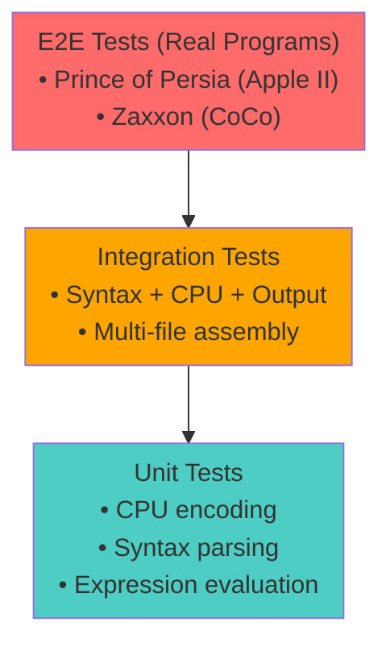

# xasm++ Testing Strategy

**Version:** 1.0
**Date:** 2026-01-19
**Status:** Draft

---

## Overview

xasm++ employs a comprehensive, multi-layered testing strategy to ensure correctness, compatibility, and quality. Testing ranges from focused unit tests to full real-world program assembly validation.

---

## Test Pyramid



**Width = Number of Tests** (Unit tests are most numerous, E2E tests are fewest)

---

## Test Levels

### Level 1: Unit Tests (Narrow, Fast)

**Purpose:** Test individual components in isolation

**Framework:** GoogleTest

**Coverage Target:** 90%+ for core modules, 80%+ for plugins

**Location:** `tests/unit/`

#### CPU Plugin Unit Tests

**File:** `tests/unit/test_cpu_6502.cpp`

```cpp
TEST(Cpu6502, ImmediateMode) {
    auto cpu = CpuRegistry::Create("6502");
    uint8_t code[] = {0xA9, 0x42};  // LDA #$42

    auto inst = cpu->ParseInstruction("LDA", "#$42");
    auto encoded = cpu->Encode(*inst, symbols, 0x8000);

    EXPECT_EQ(encoded.size(), 2);
    EXPECT_EQ(encoded[0], 0xA9);
    EXPECT_EQ(encoded[1], 0x42);
}

TEST(Cpu6502, ZeroPageOptimization) {
    auto cpu = CpuRegistry::Create("6502");

    // LDA $0080 should optimize to zero-page
    auto inst = cpu->ParseInstruction("LDA", "$0080");
    auto size = cpu->CalculateSize(*inst, symbols, 0x8000);

    EXPECT_EQ(size, 2);  // Zero-page, not absolute (3 bytes)
}
```

#### Syntax Plugin Unit Tests

**File:** `tests/unit/test_scmasm_syntax.cpp`

```cpp
TEST(ScmasmSyntax, ParseDirective) {
    auto syntax = SyntaxRegistry::Create("scmasm");

    std::string line = "    .ORG $8000";
    auto atoms = syntax->ParseLine(line);

    ASSERT_EQ(atoms.size(), 1);
    EXPECT_EQ(atoms[0]->type, AtomType::Org);
    EXPECT_EQ(atoms[0]->address, 0x8000);
}

TEST(ScmasmSyntax, LocalLabels) {
    auto syntax = SyntaxRegistry::Create("scmasm");

    // Local labels start with ]:
    std::string line = "]LOOP   LDA #$00";
    auto atoms = syntax->ParseLine(line);

    ASSERT_EQ(atoms.size(), 2);  // Label + instruction
    EXPECT_EQ(atoms[0]->type, AtomType::Label);
    // Verify local label handling
}
```

#### Expression Evaluator Unit Tests

**File:** `tests/unit/test_expression.cpp`

```cpp
TEST(Expression, ArithmeticOperators) {
    SymbolTable symbols;
    symbols.Define("VALUE", 0x10);

    auto expr = ParseExpression("VALUE * 2 + 5");
    EXPECT_EQ(expr->Evaluate(symbols), 0x25);
}

TEST(Expression, LoHiByte) {
    SymbolTable symbols;
    symbols.Define("ADDR", 0x1234);

    auto lo = ParseExpression("<ADDR");
    auto hi = ParseExpression(">ADDR");

    EXPECT_EQ(lo->Evaluate(symbols), 0x34);
    EXPECT_EQ(hi->Evaluate(symbols), 0x12);
}
```

---

### Level 2: Integration Tests (Medium Scope)

**Purpose:** Test plugin interactions and workflows

**Framework:** GoogleTest + file comparison

**Location:** `tests/integration/`

#### Syntax + CPU + Output Integration

**File:** `tests/integration/test_6502_assembly.cpp`

```cpp
TEST(Integration6502, SimpleProgram) {
    const char* source = R"(
        .ORG $8000
START   LDA #$00
        STA $00
        JMP START
        .END
    )";

    // Assemble
    Assembler asm;
    asm.SetCpu("6502");
    asm.SetSyntax("mos");

    auto result = asm.AssembleString(source);
    ASSERT_TRUE(result.success);

    // Verify binary
    std::vector<uint8_t> expected = {
        0xA9, 0x00,  // LDA #$00
        0x85, 0x00,  // STA $00
        0x4C, 0x00, 0x80  // JMP $8000
    };

    EXPECT_EQ(result.binary, expected);
}

TEST(Integration6502, ForwardReferences) {
    const char* source = R"(
        .ORG $8000
        JMP TARGET
        NOP
TARGET  RTS
    )";

    auto result = AssembleString(source, "6502", "mos");

    // Verify JMP resolved correctly
    EXPECT_EQ(result.binary[1], 0x03);  // Low byte of $8003
    EXPECT_EQ(result.binary[2], 0x80);  // High byte
}
```

#### Multi-File Assembly

**File:** `tests/integration/test_multifile.cpp`

```cpp
TEST(MultiFile, IncludeDirective) {
    // Create temporary files
    WriteFile("main.asm", R"(
        .INCLUDE "defs.asm"
        LDA #MYCONST
    )");

    WriteFile("defs.asm", R"(
MYCONST .EQ $42
    )");

    auto result = AssembleFile("main.asm", "6502", "mos");
    ASSERT_TRUE(result.success);

    EXPECT_EQ(result.binary[0], 0xA9);  // LDA immediate
    EXPECT_EQ(result.binary[1], 0x42);  // Value from included file
}
```

---

### Level 3: Regression Tests (Vasm Compatibility)

**Purpose:** Ensure output matches vasm-ext byte-for-byte

**Framework:** Python test runner + binary comparison

**Location:** `tests/regression/`

**Strategy:**
1. Port test cases from vasm-ext test suites
2. Assemble with both vasm and xasm++
3. Compare binary outputs byte-for-byte
4. Compare symbol tables
5. Compare listing files

#### Regression Test Structure

```
tests/regression/
├── scmasm/                 # SCMASM syntax tests
│   ├── basic.asm
│   ├── macros.asm
│   ├── expressions.asm
│   └── expected/
│       ├── basic.bin       # vasm output (golden)
│       ├── basic.sym
│       └── basic.lst
├── edtasm/                 # EDTASM syntax tests
├── merlin/                 # Merlin syntax tests
└── run_regression.py       # Test runner
```

#### Regression Test Runner

**File:** `tests/regression/run_regression.py`

```python
#!/usr/bin/env python3
import subprocess
import sys
from pathlib import Path

def run_regression_test(test_file, cpu, syntax):
    """Run regression test against vasm output."""

    # Assemble with xasm++
    result = subprocess.run([
        'xasm++',
        '--cpu', cpu,
        '--syntax', syntax,
        '--output', f'{test_file.stem}.bin',
        '--symbols', f'{test_file.stem}.sym',
        test_file
    ], capture_output=True)

    if result.returncode != 0:
        print(f"❌ FAIL: {test_file} - Assembly failed")
        print(result.stderr.decode())
        return False

    # Compare against golden binary
    golden = Path('expected') / f'{test_file.stem}.bin'
    actual = Path(f'{test_file.stem}.bin')

    if not filecmp.cmp(golden, actual, shallow=False):
        print(f"❌ FAIL: {test_file} - Binary mismatch")
        show_diff(golden, actual)
        return False

    print(f"✅ PASS: {test_file}")
    return True

def show_diff(golden, actual):
    """Show hex diff of binary files."""
    with open(golden, 'rb') as f1, open(actual, 'rb') as f2:
        g = f1.read()
        a = f2.read()

        for i, (b1, b2) in enumerate(zip(g, a)):
            if b1 != b2:
                print(f"  Offset {i:04X}: expected {b1:02X}, got {b2:02X}")
```

---

### Level 4: Real-World Program Tests (End-to-End)

**Purpose:** Validate assembler with actual commercial software

**Framework:** Custom test harness + emulator validation

**Location:** `tests/e2e/`

#### E2E Test Cases

##### Apple II: Prince of Persia

**Source:** Prince of Persia source code (already assembled with vasm-ext)

**Files:**
- `tests/e2e/apple2/prince_of_persia/`
  - `src/` - Original source files
  - `Makefile` - Build script
  - `expected/` - Known-good binaries from vasm-ext
  - `validate.sh` - Validation script

**Test Process:**
```bash
#!/bin/bash
# tests/e2e/apple2/prince_of_persia/validate.sh

set -e

echo "Building Prince of Persia with xasm++..."

# Assemble all components
xasm++ --cpu 6502 --syntax scmasm --format dos33 -o MAIN.BIN src/main.asm
xasm++ --cpu 6502 --syntax scmasm --format dos33 -o LEVEL1.BIN src/level1.asm
# ... more components

# Build full disk image
python3 build_disk_image.py

# Compare against known-good build
if cmp --silent PRINCE.DSK expected/PRINCE.DSK; then
    echo "✅ PASS: Prince of Persia disk image matches!"
else
    echo "❌ FAIL: Disk image mismatch"
    exit 1
fi

# Optional: Test in emulator
if [ "$RUN_EMULATOR" = "1" ]; then
    echo "Testing in AppleWin emulator..."
    applewin --disk PRINCE.DSK --test
fi
```

**Validation Criteria:**
- ✅ All source files assemble without errors
- ✅ Binary components match vasm-ext output byte-for-byte
- ✅ Disk image matches known-good image
- ✅ Game loads and runs correctly in AppleWin/MAME
- ✅ No visual glitches or crashes

##### CoCo: Zaxxon

**Source:** Zaxxon disassembly (reassembled with vasm-ext)

**Files:**
- `tests/e2e/coco/zaxxon/`
  - `src/zaxxon.asm` - Disassembled source
  - `Makefile` - Build script
  - `expected/` - Known-good binaries
  - `validate.sh` - Validation script

**Test Process:**
```bash
#!/bin/bash
# tests/e2e/coco/zaxxon/validate.sh

set -e

echo "Building Zaxxon with xasm++..."

# Assemble with DECB format
xasm++ --cpu 6809 --syntax edtasm --format decb -o ZAXXON.BIN src/zaxxon.asm

# Compare against known-good build
if cmp --silent ZAXXON.BIN expected/ZAXXON.BIN; then
    echo "✅ PASS: Zaxxon binary matches!"
else
    echo "❌ FAIL: Binary mismatch"
    hexdump -C ZAXXON.BIN > actual.hex
    hexdump -C expected/ZAXXON.BIN > expected.hex
    diff expected.hex actual.hex || true
    exit 1
fi

# Test in MAME CoCo emulator
if [ "$RUN_EMULATOR" = "1" ]; then
    echo "Testing in MAME..."
    mame coco3 -window -rompath . -flop1 ZAXXON.DSK -autoboot_delay 2
fi
```

**Validation Criteria:**
- ✅ Source assembles without errors
- ✅ Binary matches vasm-ext output byte-for-byte
- ✅ DECB format loads correctly (preamble/postamble valid)
- ✅ Game loads and runs correctly in MAME CoCo emulator
- ✅ All game screens render correctly
- ✅ Gameplay is identical to original

---

## Test Data Organization

```
tests/
├── unit/                       # Unit tests (GoogleTest)
│   ├── test_cpu_6502.cpp
│   ├── test_cpu_6809.cpp
│   ├── test_cpu_z80.cpp
│   ├── test_scmasm_syntax.cpp
│   ├── test_edtasm_syntax.cpp
│   ├── test_expression.cpp
│   ├── test_symbol_table.cpp
│   └── CMakeLists.txt
│
├── integration/                # Integration tests
│   ├── test_6502_assembly.cpp
│   ├── test_6809_assembly.cpp
│   ├── test_multifile.cpp
│   ├── test_output_formats.cpp
│   └── CMakeLists.txt
│
├── regression/                 # Vasm compatibility tests
│   ├── scmasm/
│   │   ├── basic.asm
│   │   ├── macros.asm
│   │   ├── expected/*.bin     # Golden binaries from vasm
│   │   └── README.md
│   ├── edtasm/
│   ├── merlin/
│   └── run_regression.py
│
├── e2e/                        # Real-world programs
│   ├── apple2/
│   │   └── prince_of_persia/
│   │       ├── src/
│   │       ├── expected/
│   │       ├── Makefile
│   │       └── validate.sh
│   ├── coco/
│   │   └── zaxxon/
│   │       ├── src/zaxxon.asm
│   │       ├── expected/
│   │       ├── Makefile
│   │       └── validate.sh
│   └── README.md
│
└── fixtures/                   # Shared test data
    ├── sample_binaries/
    ├── rom_images/
    └── disk_images/
```

---

## Test Execution

### Local Development

```bash
# Run all unit tests
cd build
ctest --output-on-failure

# Run specific test suite
./tests/unit/test_cpu_6502

# Run with coverage
cmake -DCMAKE_BUILD_TYPE=Debug -DENABLE_COVERAGE=ON ..
make
make test
make coverage  # Generates coverage report
```

### Regression Tests

```bash
# Run all regression tests
cd tests/regression
python3 run_regression.py

# Run specific syntax tests
python3 run_regression.py scmasm

# Verbose output
python3 run_regression.py --verbose
```

### E2E Tests

```bash
# Run all E2E tests
cd tests/e2e
make test

# Run specific platform
cd tests/e2e/apple2/prince_of_persia
make clean test

# Run with emulator validation
RUN_EMULATOR=1 make test
```

---

## Continuous Integration

**GitHub Actions Workflow:**

```yaml
name: CI

on: [push, pull_request]

jobs:
  test:
    strategy:
      matrix:
        os: [ubuntu-latest, macos-latest, windows-latest]

    runs-on: ${{ matrix.os }}

    steps:
    - uses: actions/checkout@v3
      with:
        submodules: true  # For vasm-ext test data

    - name: Build
      run: |
        mkdir build && cd build
        cmake -DBUILD_TESTING=ON ..
        cmake --build .

    - name: Unit Tests
      run: |
        cd build
        ctest --output-on-failure

    - name: Regression Tests
      run: |
        cd tests/regression
        python3 run_regression.py

    - name: E2E Tests (No Emulator)
      run: |
        cd tests/e2e
        make test
```

---

## Coverage Goals

| Component | Target Coverage | Rationale |
|-----------|----------------|-----------|
| Core (Atom, Expression, Symbol) | 95% | Critical foundation |
| CPU Plugins | 85% | Complex encoding logic |
| Syntax Plugins | 80% | Parser complexity |
| Output Plugins | 80% | Format validation |
| Utilities | 70% | Helper functions |
| **Overall** | **85%** | Industry standard |

---

## Test Development Workflow

### TDD Process (Red-Green-Refactor)

**Phase 1: RED - Write Failing Test**
```cpp
TEST(Cpu6502, ZeroPageIndexedX) {
    auto cpu = CpuRegistry::Create("6502");
    auto inst = cpu->ParseInstruction("LDA", "$80,X");

    auto encoded = cpu->Encode(*inst, symbols, 0x8000);

    EXPECT_EQ(encoded[0], 0xB5);  // LDA zp,X opcode
    EXPECT_EQ(encoded[1], 0x80);
}
```

**Phase 2: GREEN - Make It Pass**
```cpp
// Implement addressing mode in cpu_6502.cpp
if (operand.mode == AddressingMode::ZeroPageX) {
    bytes.push_back(opcode_table_.zp_x);
    bytes.push_back(static_cast<uint8_t>(operand.value));
}
```

**Phase 3: REFACTOR - Improve Code**
```cpp
// Extract method for zero-page encoding
void Cpu6502::EncodeZeroPage(std::vector<uint8_t>& bytes,
                             uint8_t opcode,
                             uint16_t address) {
    bytes.push_back(opcode);
    bytes.push_back(static_cast<uint8_t>(address & 0xFF));
}
```

---

## Test Maintenance

### Updating Golden Binaries

When vasm-ext output changes (legitimate improvements):

```bash
# Regenerate golden binaries
cd tests/regression/scmasm
make regenerate-golden

# This runs vasm-ext to create new expected/*.bin files
# Commit changes with explanation:
git add expected/
git commit -m "Update golden binaries: vasm-ext fixed bug #123"
```

### Adding New Test Cases

```bash
# 1. Create test source
cat > tests/regression/scmasm/newtest.asm <<EOF
    .ORG $8000
    LDA #$00
EOF

# 2. Generate golden binary with vasm
vasm6502_scmasm -o expected/newtest.bin newtest.asm

# 3. Add to test runner
echo "newtest.asm" >> test_manifest.txt

# 4. Run test
python3 run_regression.py scmasm/newtest
```

---

## Troubleshooting Test Failures

### Binary Mismatch

```bash
# Show hex diff
hexdump -C expected/test.bin > expected.hex
hexdump -C actual/test.bin > actual.hex
diff -u expected.hex actual.hex
```

### Symbol Table Differences

```bash
# Compare symbol tables
diff expected/test.sym actual/test.sym
```

### E2E Emulator Failures

```bash
# Enable detailed logging
xasm++ --cpu 6502 --syntax scmasm --verbose -o game.bin game.asm 2>&1 | tee build.log

# Run emulator with debugging
applewin --disk game.dsk --debug --log emulator.log
```

---

## Benefits of This Testing Strategy

✅ **Confidence** - Real-world programs validate correctness
✅ **Regression Prevention** - Vasm compatibility tests catch breaking changes
✅ **Documentation** - Tests serve as usage examples
✅ **Refactoring Safety** - Comprehensive coverage enables safe improvements
✅ **Platform Validation** - E2E tests verify actual hardware/emulator compatibility
✅ **Community Trust** - Byte-for-byte vasm compatibility builds confidence

---

## References

- GoogleTest Documentation: https://google.github.io/googletest/
- vasm Documentation: http://sun.hasenbraten.de/vasm/
- Prince of Persia Source: https://github.com/jmechner/Prince-of-Persia-Apple-II
- MAME Documentation: https://docs.mamedev.org/

---

**Document Status:** ✅ Ready for Implementation
**Next Review:** After Phase 1 completion
**Owner:** Bryan Woodruff / Testing Lead
