# xasm++ Architecture Documentation Index

**Last Updated:** 2026-02-14  
**Status:** Complete

---

## Quick Navigation

### Core Architecture Documents

1. **[Architecture Overview (README.md)](README.md)** 📖 **START HERE**
   - System architecture high-level overview
   - Component interactions and data flow
   - Core abstractions (Atom, Expression, Symbol, Section)
   - Scalability and security considerations
   - **Status:** Complete, comprehensive reference

2. **[Plugin Architecture](03-03-plugin-architecture.md)** 🔌
   - CPU plugin system (Strategy Pattern)
   - Syntax plugin system (Template Method - proposed)
   - Output plugin system
   - Plugin registration and discovery
   - Implementation examples and testing strategies
   - **Status:** Complete with future enhancements

3. **[Multi-Pass Assembly](06-06-multipass-assembly.md)** 🔄
   - Two-phase assembly algorithm (fast/safe)
   - Forward reference resolution
   - Branch relaxation handling (6502, 6809, Z80)
   - Convergence algorithm
   - Edge cases and performance optimization
   - **Status:** Complete with implementation details

4. **[Design Patterns](09-09-design-patterns.md)** 🎨
   - Creational patterns (Factory, Singleton)
   - Structural patterns (Strategy, Composite, Facade)
   - Behavioral patterns (Template Method, Visitor, Iterator)
   - Anti-patterns to avoid (God Class, Magic Numbers)
   - Pattern selection guidelines
   - **Status:** Complete pattern catalog

5. **[ADR Summary](10-10-adr-summary.md)** 📋
   - All Architecture Decision Records
   - Implemented decisions (ADR-001 through ADR-003)
   - Proposed decisions (ADR-004 through ADR-006)
   - Rejected alternatives (ADR-007, ADR-008)
   - Future considerations (ADR-009, ADR-010)
   - **Status:** Living document, updated as decisions made

---

## Document Relationships

```mermaid
graph TD
    README["README.md (START HERE)<br/>System Architecture Overview<br/>• High-level architecture<br/>• Component overview<br/>• Quick reference"]
    
    Plugin["Plugin Architecture<br/><br/>Deep dive on<br/>CPU, Syntax,<br/>Output plugins"]
    MultiPass["Multi-Pass Assembly<br/><br/>Deep dive on<br/>assembly<br/>algorithm"]
    Patterns["Design Patterns<br/><br/>Pattern<br/>catalog and<br/>guidelines"]
    ADR["ADR Summary<br/><br/>Architecture<br/>decisions<br/>with context"]
    
    Related["Related Documents<br/>• Coding Standards<br/>• Style Guide<br/>• README.md"]
    
    README --> Plugin
    README --> MultiPass
    README --> Patterns
    README --> ADR
    
    Plugin --> Related
    MultiPass --> Related
    Patterns --> Related
    ADR --> Related
    
    style README fill:#e1f5ff
    style Plugin fill:#fff4e1
    style MultiPass fill:#ffe1f5
    style Patterns fill:#e1ffe1
    style ADR fill:#ffe1e1
    style Related fill:#f0f0f0
```

---

## Reading Paths

### For New Developers (Onboarding)

**Day 1: Understanding the System**
1. [README.md](README.md) - System Architecture Overview
   - Read: System Architecture Overview
   - Read: Component Interactions
   - Read: Core Abstractions
2. [Design Patterns](09-09-design-patterns.md) - Patterns Used
   - Read: Strategy Pattern (CPU plugins)
   - Read: Composite Pattern (Expression trees)
   - Read: Facade Pattern (Assembler)

**Day 2: Deep Dives**
3. [Plugin Architecture](03-03-plugin-architecture.md)
   - Read: CPU Plugin System
   - Read: Implementation Examples
4. [Multi-Pass Assembly](06-06-multipass-assembly.md)
   - Read: High-Level Overview
   - Read: Phase 1 and Phase 2 algorithms

**Day 3: Decision Context**
5. [ADR Summary](10-10-adr-summary.md)
   - Read: All Implemented ADRs
   - Read: Proposed ADRs

---

### For Adding a New CPU

**Required Reading:**
1. [Plugin Architecture](03-03-plugin-architecture.md)
   - Section: CPU Plugin System
   - Section: Implementation Example: 6502
   - Section: Adding a New CPU Plugin
2. [ADR Summary](10-10-adr-summary.md)
   - ADR-001: CPU Plugin Architecture
   - ADR-005: Opcode Organization Pattern
   - ADR-006: Error Handling Strategy
3. [Design Patterns](09-09-design-patterns.md)
   - Strategy Pattern
   - Anti-patterns to avoid (God Class)

**Implementation Checklist:**
- [ ] Create class inheriting from `CpuPlugin`
- [ ] Create separate opcode header (follow ADR-005)
- [ ] Implement `EncodeInstruction()` with exception throwing (ADR-006)
- [ ] Implement addressing mode parsing
- [ ] Handle branch relaxation (if applicable)
- [ ] Add comprehensive unit tests
- [ ] Document CPU-specific features

---

### For Adding a New Syntax

**Required Reading:**
1. [Plugin Architecture](03-03-plugin-architecture.md)
   - Section: Syntax Plugin System (proposed)
   - Section: Template Method Pattern
2. [ADR Summary](10-10-adr-summary.md)
   - ADR-004: Syntax Parser Interface
3. [Design Patterns](09-09-design-patterns.md)
   - Template Method Pattern
   - When to Use Template Method

**Implementation Checklist:**
- [ ] Inherit from `BaseSyntaxParser` (when implemented)
- [ ] Override `ExtractComment()` for syntax-specific comment handling
- [ ] Override `ExtractLabel()` for syntax-specific label parsing
- [ ] Use base class directive handlers (ORG, EQU, DB, etc.)
- [ ] Add syntax-specific directives if needed
- [ ] Add comprehensive unit tests
- [ ] Document syntax features and differences

---

### For Understanding Multi-Pass Assembly

**Required Reading:**
1. [Multi-Pass Assembly](06-06-multipass-assembly.md) - Complete document
   - Why Multi-Pass Assembly?
   - Multi-Pass Algorithm
   - Implementation Details
   - Branch Relaxation Handling
2. [ADR Summary](10-10-adr-summary.md)
   - ADR-003: Multi-Pass Assembly with Fast/Safe Phases
3. [README.md](README.md)
   - Section: Two-Pass Assembly Process

**Key Concepts:**
- Forward references
- Branch relaxation
- Convergence checking
- Fast phase vs. safe phase
- Size change tracking

---

### For Code Review

**Review Checklist:**
- [ ] Does code follow patterns in [Design Patterns](09-09-design-patterns.md)?
- [ ] Does architecture align with [README.md](README.md)?
- [ ] Do plugin changes follow [Plugin Architecture](03-03-plugin-architecture.md)?
- [ ] Are ADRs updated if architecture decisions changed?
- [ ] Does code avoid anti-patterns listed in [Design Patterns](09-09-design-patterns.md)?

---

## Document Status

| Document | Lines | Status | Last Updated | Completeness |
|----------|-------|--------|--------------|--------------|
| README.md | ~1450 | ✅ Complete | 2026-02-14 | 100% |
| 03-plugin-architecture.md | ~750 | ✅ Complete | 2026-02-14 | 100% |
| 06-multipass-assembly.md | ~800 | ✅ Complete | 2026-02-14 | 100% |
| 09-design-patterns.md | ~650 | ✅ Complete | 2026-02-14 | 100% |
| 10-adr-summary.md | ~700 | ✅ Complete | 2026-02-14 | 100% (living) |
| INDEX.md | ~250 | ✅ Complete | 2026-02-14 | 100% |

**Total Documentation:** ~4,600 lines of comprehensive architecture reference

---

## Coverage Matrix

### Topics Covered

| Topic | Coverage | Document(s) |
|-------|----------|-------------|
| System Architecture | ✅ Complete | README.md |
| Component Interactions | ✅ Complete | README.md |
| CPU Plugin System | ✅ Complete | 03-plugin-architecture.md, README.md |
| Syntax Plugin System | ✅ Complete | 03-plugin-architecture.md (proposed) |
| Output Plugin System | ✅ Complete | 03-plugin-architecture.md |
| Multi-Pass Algorithm | ✅ Complete | 06-multipass-assembly.md, README.md |
| Branch Relaxation | ✅ Complete | 06-multipass-assembly.md |
| Expression Trees | ✅ Complete | README.md, 09-design-patterns.md |
| Symbol Resolution | ✅ Complete | README.md, 06-multipass-assembly.md |
| Design Patterns | ✅ Complete | 09-design-patterns.md |
| ADRs (Implemented) | ✅ Complete | 10-adr-summary.md |
| ADRs (Proposed) | ✅ Complete | 10-adr-summary.md |
| Scalability | ✅ Complete | README.md, 06-multipass-assembly.md |
| Security | ✅ Complete | README.md |
| Testing Strategy | ✅ Complete | 03-plugin-architecture.md, 06-multipass-assembly.md |
| Performance | ✅ Complete | 06-multipass-assembly.md, README.md |

---

## Maintenance Guidelines

### Updating Architecture Documentation

**When to Update:**
- ✅ After implementing a proposed ADR → Update ADR status in 10-adr-summary.md
- ✅ When making architectural changes → Create new ADR in 10-adr-summary.md
- ✅ When refactoring patterns → Update 09-design-patterns.md
- ✅ When changing multi-pass algorithm → Update 06-multipass-assembly.md
- ✅ When adding plugin types → Update 03-plugin-architecture.md
- ✅ When core abstractions change → Update README.md

**Review Schedule:**
- **Quarterly:** Review all documents for accuracy
- **Before releases:** Ensure documentation reflects implementation
- **After major refactorings:** Update affected documents

---

## Related Documentation

### Project Root Documentation
- [Project README](../../README.md) - Project overview and quick start
- [Coding Standards](../CODING-STANDARDS.md) - C++ coding conventions
- [Style Guide](../STYLE_GUIDE.md) - Code formatting rules

### Content Documentation (Docusaurus)
- [Content Architecture Overview](../content/architecture/overview.md) - User-facing architecture docs

### Development Documentation
- [Task Packets](../../.ai/tasks/) - Development history and task tracking

---

## Glossary

**Atom** - Intermediate representation node (label, instruction, data, etc.)

**Branch Relaxation** - Process of expanding short branches to long branches when targets are out of range

**Convergence** - State where instruction sizes no longer change between passes

**CPU Plugin** - Strategy pattern implementation for CPU-specific instruction encoding

**Expression Tree** - Composite pattern structure for arithmetic expressions with symbol references

**Forward Reference** - Label or symbol used before it's defined in source code

**Multi-Pass Assembly** - Algorithm that assembles source multiple times until all references resolve

**Opcode** - Numeric machine code instruction identifier

**Syntax Plugin** - Parser for assembly syntax dialect (Merlin, SCMASM, etc.)

**Symbol Table** - Mapping of symbol names to numeric values (addresses, constants)

---

## Contributing to Documentation

**Style Guidelines:**
- Use Markdown format
- Include code examples where applicable
- Add diagrams for complex concepts (ASCII or Mermaid)
- Cross-reference related documents
- Keep examples up-to-date with code

**Pull Request Checklist for Documentation:**
- [ ] Spell-checked and grammar-checked
- [ ] Code examples tested and working
- [ ] Cross-references updated
- [ ] INDEX.md updated if new document added
- [ ] Related documents updated if context changed

---

## Questions or Issues?

**For architecture questions:**
1. Check this index for relevant document
2. Read the specific document section
3. Check ADR Summary for decision context
4. If still unclear, ask on project discussions

**For documentation improvements:**
1. Open an issue describing the gap
2. Or submit a pull request with improvements

---

**Document Version:** 1.0  
**Maintained By:** xasm++ Architecture Team  
**Next Review:** 2026-05-14 (Quarterly)
