# xasm++ Architecture Reference

**Version:** 1.0  
**Last Updated:** 2026-02-14  
**Status:** Complete

---

## Table of Contents

1. [System Architecture Overview](#system-architecture-overview)
2. [Component Interactions](#component-interactions)
3. [Plugin Architecture](#plugin-architecture)
4. [Two-Pass Assembly Process](#two-pass-assembly-process)
5. [Design Patterns](#design-patterns)
6. [Core Abstractions](#core-abstractions)
7. [ADRs Summary](#adrs-summary)
8. [Scalability Considerations](#scalability-considerations)
9. [Security Considerations](#security-considerations)

---

## System Architecture Overview

**xasm++** is a modern C++ cross-assembler that combines proven modular design patterns with SOLID principles. The architecture is based on three key insights:

1. **Plugin-Based Extensibility** - CPUs, syntaxes, and output formats as plugins
2. **Multi-Pass Resolution** - Proven vasm-ext approach for handling forward references
3. **Clean Abstractions** - Atom-based IR separates parsing from encoding

### High-Level Architecture Diagram

```mermaid
graph TB
    subgraph CLI["CLI Interface<br/>(User Interface Layer)"]
        CLI1["• Command-line argument parsing"]
        CLI2["• Configuration management"]
        CLI3["• Error reporting and logging"]
    end
    
    subgraph Engine["Assembler Engine<br/>(Core Business Logic)"]
        subgraph Resolution["Multi-Pass Resolution Engine"]
            R1["• Symbol table management"]
            R2["• Expression evaluation"]
            R3["• Forward reference resolution"]
            R4["• Branch relaxation"]
            R5["• Convergence checking"]
        end
        
        subgraph AtomChain["Atom Chain (Intermediate Representation)"]
            A1["• Label atoms (symbol definitions)"]
            A2["• Instruction atoms (CPU operations)"]
            A3["• Data atoms (raw bytes/expressions)"]
            A4["• Directive atoms (ORG, ALIGN, SPACE)"]
        end
    end
    
    subgraph Syntax["Syntax Plugins"]
        S1["• Parse source"]
        S2["• Create atoms"]
        S3["• Handle macros"]
        S_List["SimpleSyntax<br/>MerlinSyntax<br/>EdtasmSyntax<br/>ScmasmSyntax<br/>FlexAsmSyntax<br/>Z80UniversalSyntax"]
    end
    
    subgraph CPU["CPU Plugin<br/>(Strategy)"]
        C1["• Encode instrs"]
        C2["• Calculate sizes"]
        C3["• Handle addr modes"]
        C_List["Cpu6502<br/>Cpu65C02<br/>Cpu65816<br/>Cpu6809<br/>CpuZ80"]
    end
    
    subgraph Output["Output Writers"]
        O1["• Binary"]
        O2["• Listing"]
        O3["• Symbols"]
        O4["• Intel HEX"]
        O5["• Motorola S-records"]
        O_List["BinaryWriter<br/>ListingWriter<br/>SymbolWriter<br/>SRecordWriter<br/>IntelHexWriter"]
    end
    
    CLI --> Engine
    Engine --> Syntax
    Engine --> CPU
    Engine --> Output
```



### Data Flow

```mermaid
flowchart TD
    A["Source File<br/>(.asm)<br/>program.asm"] --> B["Syntax Plugin<br/>• Parse lines<br/>• Lexical analysis<br/>• Macro expansion"]
    B -->|"Atom Chain (IR)"| C["Assembler Engine<br/>Pass 1: Symbols<br/>• Extract label addresses<br/>• Create symbol table"]
    C -->|"Symbol Table"| D["Assembler Engine<br/>Pass 2-N: Encoding<br/>• Evaluate expressions<br/>• Encode instructions (via CPU plugin)<br/>• Check convergence"]
    D -->|"Encoded Atoms"| E["Output Writers<br/>• Binary (.bin)<br/>• Listing (.lst)<br/>• Symbols (.sym)"]
    E --> F["Output Files<br/>program.bin, program.lst"]
    
    style A fill:#e1f5ff
    style F fill:#e1f5ff
```



### Key Architectural Principles

**1. Separation of Concerns**
- **Syntax Parsing** ↔ **Instruction Encoding** ↔ **Output Generation**
- Each layer has a single, well-defined responsibility
- Changes in one layer don't cascade to others

**2. Open/Closed Principle**
- Open for extension (add new CPU/syntax via plugins)
- Closed for modification (core engine unchanged)

**3. Dependency Inversion**
- Core engine depends on abstractions (CpuPlugin, SyntaxParser)
- Not on concrete implementations (Cpu6502, MerlinSyntax)

**4. Interface Segregation**
- Small, focused interfaces (CpuPlugin, SymbolTable)
- Clients only depend on methods they use

**5. Single Responsibility**
- Each class has one reason to change
- Atoms represent data only (no encoding logic)
- CPU plugins handle encoding only (no parsing)
- Assembler engine handles resolution only (no I/O)

---

## Component Interactions

### Assembly Pipeline Sequence Diagram


### Component Responsibilities

#### 1. CLI Interface (`cli_parser.cpp`, `main.cpp`)
**Responsibilities:**
- Parse command-line arguments
- Load configuration files
- Validate input parameters
- Initialize assembler components
- Report errors to user

**Does NOT:**
- Encode instructions
- Parse assembly syntax
- Manage symbols
- Generate output files

#### 2. Assembler Engine (`assembler.cpp`, `assembler.h`)
**Responsibilities:**
- Manage multi-pass assembly process
- Maintain symbol table
- Evaluate expressions
- Track atom sizes and addresses
- Check for convergence
- Coordinate between plugins

**Does NOT:**
- Parse source files (delegates to Syntax Plugin)
- Encode instructions (delegates to CPU Plugin)
- Write output files (delegates to Output Writers)
- Know about specific CPU architectures

#### 3. CPU Plugins (`cpu_6502.cpp`, `cpu_6809.cpp`, `cpu_z80.cpp`)
**Responsibilities:**
- Encode instructions to machine code
- Calculate instruction sizes
- Parse addressing modes
- Validate operand ranges
- Handle CPU-specific features (branch relaxation)

**Does NOT:**
- Parse source files
- Manage symbols
- Generate output files
- Know about assembly syntax

#### 4. Syntax Plugins (`merlin_syntax.cpp`, `scmasm_syntax.cpp`, etc.)
**Responsibilities:**
- Parse source text into atoms
- Handle directives (ORG, EQU, DB, DW, etc.)
- Expand macros
- Manage conditional assembly
- Handle includes

**Does NOT:**
- Encode instructions (delegates to CPU Plugin)
- Resolve symbols (delegates to Assembler)
- Generate output (delegates to Output Writers)

#### 5. Output Writers (`binary_output.cpp`, `listing_output.cpp`, etc.)
**Responsibilities:**
- Serialize atoms to output format
- Generate listing files with cross-references
- Generate symbol tables
- Format output for specific formats (binary, Intel HEX, S-records)

**Does NOT:**
- Parse source files
- Encode instructions
- Resolve symbols
- Perform multi-pass assembly

---

## Plugin Architecture

### CPU Plugin Architecture (Strategy Pattern)

The CPU plugin system uses the **Strategy Pattern** to encapsulate CPU-specific instruction encoding algorithms. This allows adding new CPU architectures without modifying the core assembler.

#### CpuPlugin Interface

```cpp
class CpuPlugin {
public:
  virtual ~CpuPlugin() = default;

  // Metadata
  virtual std::string GetCpuFamily() const = 0;
  virtual std::vector<std::string> GetSupportedVariants() const = 0;
  virtual bool HasOpcode(const std::string& mnemonic) const = 0;

  // Core functionality
  virtual std::vector<uint8_t> EncodeInstruction(
      const std::string& mnemonic,
      uint32_t operand,
      const std::string& operand_str) const = 0;

  // Special encoding (branches, multi-operand instructions)
  virtual bool RequiresSpecialEncoding(const std::string& mnemonic) const;
  virtual std::vector<uint8_t> EncodeInstructionSpecial(
      const std::string& mnemonic,
      const std::string& operand,
      uint16_t current_address) const;
};
```

#### Implementation Pattern

**Example: 6502 CPU Plugin**

```cpp
class Cpu6502 : public CpuPlugin {
public:
  std::string GetCpuFamily() const override { return "6502"; }
  
  std::vector<std::string> GetSupportedVariants() const override {
    return {"6502", "nmos6502"};
  }
  
  bool HasOpcode(const std::string& mnemonic) const override {
    // Check against opcode table
    return opcodes_.count(ToUpper(mnemonic)) > 0;
  }
  
  std::vector<uint8_t> EncodeInstruction(
      const std::string& mnemonic,
      uint32_t operand,
      const std::string& operand_str) const override {
    
    // Parse addressing mode from operand_str
    AddressingMode mode = ParseAddressingMode(operand_str);
    
    // Look up opcode
    uint8_t opcode = LookupOpcode(mnemonic, mode);
    
    // Encode based on addressing mode
    return EncodeWithMode(opcode, mode, operand);
  }

private:
  // Addressing mode parsing
  AddressingMode ParseAddressingMode(const std::string& operand) const;
  
  // Opcode lookup table
  std::unordered_map<std::string, OpcodeInfo> opcodes_;
  
  // Encoding helpers (75 methods for all instruction variants)
  std::vector<uint8_t> EncodeADC_Immediate(uint32_t operand) const;
  std::vector<uint8_t> EncodeADC_ZeroPage(uint32_t operand) const;
  // ... (one method per instruction/addressing mode combination)
};
```

#### CPU Plugin Family Hierarchy

**Inheritance Strategy for Code Reuse:**


**Code Reuse Metrics:**
- 6502 → 65C02: ~80% code reuse (shared base opcodes)
- 65C02 → 65816: ~70% code reuse (adds 16-bit modes)
- New CPU family: ~0% reuse (different architecture)

#### Adding a New CPU Plugin

**Step-by-step process:**

1. **Create CPU plugin class:**
   ```cpp
   class CpuMyArch : public CpuPlugin {
     // Implement interface methods
   };
   ```

2. **Define opcode table:**
   ```cpp
   // opcodes_myarch.h
   namespace xasm {
   namespace Opcodes {
     constexpr uint8_t LOAD_IMM = 0x42;
     constexpr uint8_t STORE_ABS = 0x43;
     // ...
   }
   }
   ```

3. **Implement encoding methods:**
   ```cpp
   std::vector<uint8_t> CpuMyArch::EncodeInstruction(...) {
     // Parse addressing mode
     // Look up opcode
     // Encode bytes
   }
   ```

4. **Add unit tests:**
   ```cpp
   TEST(CpuMyArch, EncodeLoadImmediate) {
     CpuMyArch cpu;
     auto bytes = cpu.EncodeInstruction("LOAD", 0x42, "#$42");
     EXPECT_EQ(bytes, std::vector<uint8_t>{0x42, 0x42});
   }
   ```

5. **Register in factory (future):**
   ```cpp
   CpuRegistry::Instance().Register("myarch", 
       []() { return std::make_unique<CpuMyArch>(); });
   ```

### Syntax Plugin Architecture (Template Method Pattern)

**Status:** ⚠️ **No common interface currently** - Each syntax parser is independent.

**Recommended Architecture:**

```cpp
// Base interface (to be implemented)
class SyntaxParser {
public:
  virtual ~SyntaxParser() = default;
  
  // Core interface
  virtual ParsedLine ParseLine(const std::string& line) = 0;
  virtual bool IsDirective(const std::string& token) const = 0;
};

// Base implementation with common logic
class BaseSyntaxParser : public SyntaxParser {
protected:
  // Template Method pattern - common directives
  virtual void HandleORG(uint32_t address);
  virtual void HandleEQU(const std::string& symbol, uint32_t value);
  virtual void HandleDB(const std::vector<uint8_t>& bytes);
  virtual void HandleDW(const std::vector<uint16_t>& words);
  
  // Syntax-specific hooks (abstract)
  virtual std::string ExtractLabel(const std::string& line) = 0;
  virtual std::string ParseComment(const std::string& line) = 0;
};

// Concrete syntax implementations
class MerlinSyntaxParser : public BaseSyntaxParser {
  // Only implement syntax-specific behavior
  std::string ExtractLabel(const std::string& line) override;
  std::string ParseComment(const std::string& line) override;
};
```

**Benefits of proposed architecture:**
- Eliminates ~40% code duplication across syntax parsers
- Consistent directive behavior
- Easier to add new syntax variants
- Better testability

---

## Two-Pass Assembly Process

The xasm++ assembler uses a multi-pass algorithm to resolve forward references and optimize instruction sizes. This approach is based on the proven vasm-ext strategy.

### Why Multi-Pass Assembly?

**Problem:** Forward references and branch relaxation require multiple passes.

```assembly
; Forward reference problem:
    JMP end         ; Size unknown until 'end' address known
    ...
    ...
end:
    RTS             ; Address not known until all previous sizes known
```

**Solution:** Multiple passes that converge to stable instruction sizes.

### Pass Strategy

```mermaid
flowchart TD
    Pass1["Pass 1: Initial Symbol Collection<br/>• Parse source into atom chain<br/>• Extract label addresses (using initial size guesses)<br/>• Create symbol table<br/>• All instructions use maximum size estimates"]
    
    Pass2["Pass 2-10: Fast Optimization Phase<br/>• Optimize ALL instructions simultaneously<br/>• Try to shrink instructions where possible<br/>• Re-encode all instructions<br/>• Update symbol addresses based on new sizes<br/>• Continue until sizes converge OR 50 passes reached"]
    
    Check1{"Converged?<br/>(No size changes)"}
    
    SafePass["Pass 51-500: Safe Optimization Phase<br/>• Optimize ONE instruction per pass<br/>• Prevents oscillation<br/>• Guarantees eventual convergence<br/>• Track size changes per instruction<br/>• Warn if instruction changes too many times"]
    
    Check2{"Converged?<br/>OR Max passes?"}
    
    Output["Final Pass: Output<br/>• Generate binary<br/>• Generate listing<br/>• Generate symbols"]
    
    Pass1 --> Pass2
    Pass2 --> Check1
    Check1 -->|YES| Output
    Check1 -->|NO (after 50 passes)| SafePass
    SafePass --> Check2
    Check2 --> Output
    
    style Pass1 fill:#e1f5ff
    style Pass2 fill:#fff4e1
    style SafePass fill:#ffe1e1
    style Output fill:#e1ffe1
```

### Convergence Algorithm

**Implementation in `assembler.cpp`:**

```cpp
AssemblerResult Assembler::Assemble() {
  AssemblerResult result;
  
  // Pass 1: Initial symbol collection
  ResolveSymbols(atoms_, symbols_, org_address_, result);
  
  // Passes 2-N: Encode and optimize until convergence
  std::vector<size_t> previous_sizes;
  std::vector<size_t> current_sizes;
  
  for (int pass = 2; pass <= MAX_PASSES; ++pass) {
    // Encode all instructions with current symbol table
    current_sizes = EncodeInstructions(symbols_, result);
    
    // Check convergence
    if (CheckConvergence(previous_sizes, current_sizes)) {
      result.pass_count = pass;
      result.success = true;
      return result;  // DONE - sizes have stabilized
    }
    
    // Update symbols for next pass
    ResolveSymbols(atoms_, symbols_, org_address_, result);
    
    // Store sizes for next convergence check
    previous_sizes = current_sizes;
    
    // After fast phase, optimize more carefully
    if (pass > FAST_PHASE_LIMIT) {
      // Optimize only ONE instruction per pass
      // This prevents oscillation
    }
  }
  
  // Max passes reached without convergence
  result.success = false;
  result.errors.push_back({"Max passes exceeded", {}});
  return result;
}
```

### Size Change Tracking

**Preventing oscillation:**

```cpp
class Atom {
  size_t size;         // Current size (this pass)
  size_t last_size;    // Previous size (last pass)
  uint32_t changes;    // Number of times size has changed
};

bool Assembler::OptimizePass(int pass_number) {
  bool any_changes = false;
  int changes_this_pass = 0;
  
  for (auto& atom : atoms) {
    if (atom->type != AtomType::Instruction) continue;
    
    size_t new_size = cpu_->CalculateSize(*atom, symbols_, atom->address);
    
    if (new_size != atom->last_size) {
      // Size changed
      atom->changes++;
      atom->last_size = new_size;
      any_changes = true;
      changes_this_pass++;
      
      // After fast phase, stop after first change
      if (pass_number > FAST_PHASE_LIMIT && changes_this_pass >= 1) {
        break;  // Only one change per pass in safe mode
      }
      
      // Warn if instruction oscillating
      if (atom->changes > MAX_SIZE_CHANGES) {
        // Warning: instruction may be oscillating
      }
    }
  }
  
  return any_changes;
}
```

### Branch Relaxation Example

**6502 branch relaxation:**

```assembly
; Example: Forward branch with unknown distance
start:
    ; ... 200 bytes of code ...
    BNE far_label      ; Distance unknown initially
    ; ... 100 bytes more ...
far_label:
    RTS

; Pass 1: Assume short branch (2 bytes)
; Address calculation: far_label at start + 200 + 2 + 100 = 302
; Distance: 302 - (start + 200 + 2) = 100 bytes
; Problem: 100 > 127 (max short branch range)

; Pass 2: Use long branch workaround (5 bytes)
; BNE far_label becomes:
;     BEQ skip    ; 2 bytes - invert condition
;     JMP far_label  ; 3 bytes - absolute jump
;   skip:
;
; Addresses shift: far_label now at start + 200 + 5 + 100 = 305
; Recalculate all subsequent addresses

; Pass 3: Check convergence
; All sizes stable? -> DONE
```

### Typical Pass Counts

**Empirical observations:**

| Scenario | Pass Count | Why |
|----------|------------|-----|
| No forward refs | 1 | All sizes known immediately |
| Simple forward refs | 2 | One pass to establish addresses |
| Branch relaxation | 2-3 | One pass to detect long branch, one to stabilize |
| Complex interdependencies | 3-5 | Multiple address cascades |
| Oscillation (pathological) | 50+ | Switch to safe mode |

**Design goal:** Most programs assemble in 2-3 passes.

---

## Design Patterns

### 1. Strategy Pattern (CPU Plugins)

**Intent:** Define a family of algorithms (instruction encoders), encapsulate each one, and make them interchangeable.

**Implementation:**
- **Strategy Interface:** `CpuPlugin`
- **Concrete Strategies:** `Cpu6502`, `Cpu6809`, `CpuZ80`
- **Context:** `Assembler` class uses `CpuPlugin*`

**Benefits:**
- ✅ Add new CPUs without modifying assembler core
- ✅ Each CPU plugin is independently testable
- ✅ Runtime selection of CPU target

**Usage:**
```cpp
Assembler asm;
Cpu6502 cpu;
asm.SetCpuPlugin(&cpu);  // Inject strategy
```

### 2. Template Method Pattern (Syntax Parsers - Proposed)

**Intent:** Define the skeleton of an algorithm in a base class, letting subclasses override specific steps.

**Implementation (Proposed):**
- **Abstract Class:** `BaseSyntaxParser` with template method
- **Template Method:** `ParseLine()` with hooks
- **Concrete Classes:** `MerlinSyntaxParser`, `ScmasmSyntaxParser`

**Benefits:**
- ✅ Eliminate directive handling duplication
- ✅ Consistent behavior across syntax variants
- ✅ Easy to add new syntax styles

### 3. Visitor Pattern (Atom Processing - Implicit)

**Intent:** Separate algorithms from the objects on which they operate.

**Implementation:**
- **Elements:** Atom hierarchy (LabelAtom, InstructionAtom, DataAtom, etc.)
- **Visitors:** Assembler passes, Output writers
- **Traversal:** Iterate through atom chain, process based on type

**Benefits:**
- ✅ Add new atom processing algorithms without changing atom classes
- ✅ Multiple algorithms can operate on same atom chain

**Usage:**
```cpp
// Different "visitors" for atom chain:
void Assembler::ResolveSymbols(atoms);    // Visitor 1: Extract symbols
void Assembler::EncodeInstructions(atoms); // Visitor 2: Encode
void BinaryWriter::Write(atoms);          // Visitor 3: Serialize
```

### 4. Composite Pattern (Expression Trees)

**Intent:** Compose objects into tree structures to represent part-whole hierarchies.

**Implementation:**
- **Component:** `Expression` (abstract base)
- **Leaf:** `LiteralExpr`, `SymbolExpr`
- **Composite:** `BinaryOpExpr`, `UnaryOpExpr`

**Benefits:**
- ✅ Uniform treatment of simple and complex expressions
- ✅ Easy to add new operators
- ✅ Recursive evaluation

**Usage:**
```cpp
// Expression tree for: start + 2
auto expr = std::make_shared<BinaryOpExpr>(
    BinaryOp::Add,
    std::make_shared<SymbolExpr>("start"),
    std::make_shared<LiteralExpr>(2)
);

int64_t value = expr->Evaluate(symbols);
```

### 5. Factory Pattern (Plugin Creation - Future)

**Intent:** Define an interface for creating objects, but let subclasses decide which class to instantiate.

**Implementation (Planned):**
```cpp
class CpuRegistry {
public:
  using FactoryFunc = std::function<std::unique_ptr<CpuPlugin>()>;
  
  static CpuRegistry& Instance();
  void Register(const std::string& name, FactoryFunc factory);
  std::unique_ptr<CpuPlugin> Create(const std::string& name);
};

// Registration at startup:
CpuRegistry::Instance().Register("6502", 
    []() { return std::make_unique<Cpu6502>(); });

// Usage:
auto cpu = CpuRegistry::Instance().Create("6502");
```

**Benefits:**
- ✅ Runtime plugin selection
- ✅ Decouple plugin creation from usage
- ✅ Support for plugin discovery

### 6. Dependency Injection (Constructor Injection)

**Intent:** Pass dependencies to objects rather than having them create dependencies.

**Implementation:**
```cpp
class Assembler {
public:
  void SetCpuPlugin(CpuPlugin* cpu);      // Inject dependency
  void SetSymbolTable(SymbolTable* symbols);
};

// Usage:
Cpu6502 cpu;
ConcreteSymbolTable symbols;
Assembler asm;

asm.SetCpuPlugin(&cpu);       // Inject
asm.SetSymbolTable(&symbols); // Inject
```

**Benefits:**
- ✅ Testability (inject mocks)
- ✅ Flexibility (swap implementations)
- ✅ Decoupling (assembler doesn't know concrete types)

---

## Core Abstractions

### 1. Atom - Intermediate Representation

**Purpose:** Represent assembly language constructs as a polymorphic hierarchy.

**Hierarchy:**


**Key Fields:**
```cpp
class Atom {
public:
  AtomType type;              // What kind of atom
  SourceLocation location;    // Where in source file
  size_t size;                // Bytes occupied (current pass)
  size_t last_size;           // Bytes occupied (previous pass)
  uint32_t changes;           // Number of size changes
  std::shared_ptr<Atom> next; // Next atom in chain
  std::string source_line;    // Original source text
};
```

**Design Rationale:**
- **Why linked list?** Allows easy insertion/deletion during parsing
- **Why polymorphic?** Different atom types need different data
- **Why track sizes?** Multi-pass assembly needs convergence checking
- **Why store source line?** Listing file generation

### 2. Expression - Arithmetic and Symbol References

**Purpose:** Represent complex expressions that may contain forward references.

**Hierarchy:**


**Key Operations:**
```cpp
class Expression {
public:
  virtual int64_t Evaluate(const SymbolTable& symbols) const = 0;
  virtual bool IsConstant() const = 0;
  virtual bool IsRelocatable() const = 0;
};
```

**Design Rationale:**
- **Why tree structure?** Complex expressions need recursive evaluation
- **Why polymorphic?** Different expression types evaluate differently
- **Why IsConstant()?** Optimization (constant folding)
- **Why IsRelocatable()?** Linker needs to know what to adjust

**Example Expression Trees:**

```assembly
; Simple literal: LDA #42
LiteralExpr(42)

; Symbol reference: JMP start
SymbolExpr("start")

; Binary operation: LDA #(end-start)
BinaryOpExpr(
  Subtract,
  SymbolExpr("end"),
  SymbolExpr("start")
)

; Complex expression: LDA #((end-start)/2+1)
BinaryOpExpr(
  Add,
  BinaryOpExpr(
    Divide,
    BinaryOpExpr(Subtract, SymbolExpr("end"), SymbolExpr("start")),
    LiteralExpr(2)
  ),
  LiteralExpr(1)
)
```

### 3. SymbolTable - Symbol Resolution

**Purpose:** Store and lookup symbol values during assembly.

**Interface:**
```cpp
class SymbolTable {
public:
  virtual ~SymbolTable() = default;
  
  virtual bool Lookup(const std::string& name, int64_t& value) const = 0;
  virtual int64_t GetCurrentLocation() const = 0;
};
```

**Implementation (ConcreteSymbolTable):**
```cpp
class ConcreteSymbolTable : public SymbolTable {
public:
  void Define(const std::string& name, int64_t value);
  bool IsDefined(const std::string& name) const;
  
  bool Lookup(const std::string& name, int64_t& value) const override;
  int64_t GetCurrentLocation() const override;

private:
  std::unordered_map<std::string, int64_t> symbols_;
  int64_t current_location_ = 0;
};
```

**Design Rationale:**
- **Why interface?** Allows mock symbol tables for testing
- **Why case-insensitive?** Some assemblers are case-insensitive
- **Why track current location?** Support for $ operator in expressions

### 4. Section - Memory Segments

**Purpose:** Represent independent memory segments with different attributes.

**Structure:**
```cpp
class Section {
public:
  std::string name;                        // Section name (e.g., "CODE", "DATA")
  uint32_t attributes;                     // Flags (code, data, bss, read, write, execute)
  uint64_t org;                            // Origin address
  std::vector<std::shared_ptr<Atom>> atoms; // Atoms in this section
  size_t current_offset;                   // Current position within section
};

enum class SectionAttributes {
  Code    = 0x01,  // Contains executable code
  Data    = 0x02,  // Contains initialized data
  Bss     = 0x04,  // Contains uninitialized data
  Read    = 0x08,  // Readable
  Write   = 0x10,  // Writable
  Execute = 0x20,  // Executable
};
```

**Design Rationale:**
- **Why sections?** Modern programs have code, data, and BSS segments
- **Why attributes?** Allow output formats to set proper segment flags
- **Why independent atoms?** Each section assembles independently

---

## ADRs Summary

### Implemented Architecture Decisions

#### ADR-001: CPU Plugin Architecture (Implicit - Implemented)
**Decision:** Use Strategy pattern with polymorphic `CpuPlugin` base class.

**Rationale:**
- Extensibility: Add new CPUs without modifying core
- Separation of concerns: Encoding logic in CPU plugin, resolution in assembler
- Testability: Each CPU plugin independently testable

**Status:** ✅ Accepted and Implemented

**Consequences:**
- ✅ Easy to add new CPU targets
- ✅ Clean separation between parsing and encoding
- ⚠️ Some duplication across CPU plugins (addressing mode parsing)

---

#### ADR-002: Atom-Based Intermediate Representation (Implicit - Implemented)
**Decision:** Use atom chain as IR, inspired by vasm-ext.

**Rationale:**
- Proven design from vasm-ext (15+ years of production use)
- Supports multi-pass assembly naturally
- Clear separation between parsing and encoding phases

**Status:** ✅ Accepted and Implemented

**Consequences:**
- ✅ Clean multi-pass assembly implementation
- ✅ Easy to add new atom types
- ⚠️ Memory overhead (linked list vs. vector)

---

#### ADR-003: Multi-Pass Assembly with Fast/Safe Phases (Implicit - Implemented)
**Decision:** Use fast optimization (passes 2-50) followed by safe optimization (passes 51-500).

**Rationale:**
- Prevents oscillation in pathological cases
- Guarantees eventual convergence
- Empirically fast for typical programs (2-3 passes)

**Status:** ✅ Accepted and Implemented

**Consequences:**
- ✅ Handles complex forward references reliably
- ✅ Fast for common cases
- ⚠️ Slow for pathological cases (50+ passes)

---

### Proposed Architecture Decisions

#### ADR-004: Syntax Parser Interface (Proposed)
**Decision:** Introduce `SyntaxParser` interface with `BaseSyntaxParser` template method.

**Rationale:**
- Eliminate ~40% code duplication across syntax parsers
- Consistent directive handling
- Easier to add new syntax variants

**Status:** 📝 Proposed (not yet implemented)

**Consequences:**
- ✅ Reduced duplication
- ✅ Consistent behavior
- ⚠️ Refactoring effort required

---

#### ADR-005: Opcode Organization Pattern (Proposed)
**Decision:** Adopt modular opcode header files (separate from CPU class).

**Rationale:**
- Consistency across CPU plugins
- Easier maintenance of opcode tables
- Better separation of concerns (data vs. logic)

**Status:** 📝 Proposed (6502 already uses this pattern)

**Consequences:**
- ✅ Consistent file organization
- ✅ Easier opcode table updates
- ⚠️ More files to manage

---

#### ADR-006: Error Handling Strategy (Proposed)
**Decision:** Use exceptions for error reporting (per current `CpuPlugin` interface).

**Rationale:**
- Aligns with C++ exception model
- Clear error propagation up the call stack
- Separates error handling from normal control flow

**Status:** 📝 Proposed (needs enforcement - Z80 missing exceptions)

**Alternatives Considered:**
- Error codes (rejected: verbose, easy to ignore)
- Result<T, Error> type (rejected: not idiomatic C++)

**Consequences:**
- ✅ Clear error propagation
- ⚠️ Performance impact on hot paths (mitigated by infrequent errors)

---

## Scalability Considerations

### Horizontal Scalability (Adding Features)

#### Adding New CPU Architecture

**Current Approach:**
1. Create new class inheriting from `CpuPlugin`
2. Implement encoding methods
3. Add unit tests
4. No changes to core assembler

**Effort:** Medium (1-2 weeks for complete implementation)

**Scalability:** ✅ Good - Plugin architecture supports this well

**Optimization Opportunities:**
- Share addressing mode parsing across CPU families
- Use data-driven opcode tables instead of 75+ encoding methods
- Consider CPU plugin base classes for related architectures

---

#### Adding New Syntax Style

**Current Approach:**
1. Create new syntax parser class
2. Implement directive handling (duplicated from other parsers)
3. Add unit tests
4. No changes to core assembler

**Effort:** High (1+ week due to duplication)

**Scalability:** ⚠️ Moderate - Duplication hinders scalability

**Optimization Opportunities:**
- Implement proposed `SyntaxParser` interface
- Share directive handling in `BaseSyntaxParser`
- Reduce effort to ~2-3 days per new syntax

---

#### Adding New Output Format

**Current Approach:**
1. Create new output writer class
2. Implement serialization logic
3. Add unit tests
4. Register in output factory

**Effort:** Low (2-3 days)

**Scalability:** ✅ Good - Clean output interface

---

### Vertical Scalability (Performance)

#### Current Performance Characteristics

**Empirical Measurements (not yet benchmarked):**

| Program Size | Expected Assembly Time | Passes | Bottleneck |
|--------------|------------------------|--------|------------|
| <1KB | <10ms | 2-3 | Parsing |
| 1-10KB | <100ms | 2-3 | Encoding |
| 10-100KB | <1s | 2-4 | Symbol lookup |
| 100KB-1MB | <10s | 2-5 | Expression eval |
| >1MB | <60s | 2-5 | Memory allocation |

**Design Assumptions:**
- Most programs: <100KB source
- Most assembly: 2-3 passes
- Symbol table: O(1) hash lookup
- Expression evaluation: O(depth) tree traversal

---

#### Potential Bottlenecks

**1. Symbol Table Lookup**
- **Current:** `std::unordered_map<std::string, int64_t>`
- **Complexity:** O(1) average, O(n) worst case
- **Optimization:** Pre-hash symbol names, use string interning

**2. Expression Evaluation**
- **Current:** Recursive tree traversal on every pass
- **Complexity:** O(depth) per expression, O(n*depth) per pass
- **Optimization:** Cache constant expressions, fold at parse time

**3. Memory Allocation**
- **Current:** `std::vector<uint8_t>` allocated per instruction encoding
- **Complexity:** O(n) allocations per pass
- **Optimization:** Pre-allocate buffer pool, reuse buffers

**4. String Operations**
- **Current:** String comparisons for mnemonic lookup
- **Complexity:** O(length) per lookup
- **Optimization:** Use string_view, intern strings, hash-based lookup

---

#### Performance Optimization Strategy

**Phase 1: Measure (Before Optimizing)**
```bash
# Profile with real-world assembly files
perf record ./xasm++ large_program.asm
perf report

# Identify hotspots:
# - Where is CPU time spent?
# - How many allocations?
# - Cache misses?
```

**Phase 2: Low-Hanging Fruit**
- Cache constant expressions
- Use `string_view` for parsing (zero-copy)
- Pre-allocate atom vectors
- Intern symbol names

**Phase 3: Data Structure Optimization**
- Replace atom linked list with vector (better cache locality)
- Use memory pool for atoms
- Hash symbol names once at parse time

**Phase 4: Algorithmic Optimization**
- Incremental symbol resolution (only changed atoms)
- Parallel encoding of independent sections
- Lazy expression evaluation

**Expected Improvements:**
- Phase 2: 20-30% speedup
- Phase 3: 40-50% speedup
- Phase 4: 2x speedup for large programs

---

### Concurrency Considerations

**Current State:** ⚠️ Not thread-safe

**Opportunities for Parallelization:**

1. **Section-Level Parallelism**
   - Assemble independent sections in parallel
   - Merge symbol tables afterward
   - **Speedup:** 2-4x for programs with multiple sections

2. **Atom-Level Parallelism (Encoding Pass)**
   - Encode instructions in parallel
   - Requires read-only symbol table
   - **Speedup:** 4-8x on multi-core CPUs

3. **File-Level Parallelism**
   - Assemble multiple source files in parallel
   - **Speedup:** Nx for N files (perfect scaling)

**Challenges:**
- Symbol table shared state (requires locking or partitioning)
- Atom address dependencies (need dependency analysis)
- Error reporting (need thread-safe error collection)

**Recommended Approach:**
1. Start with file-level parallelism (easiest)
2. Add section-level parallelism (medium difficulty)
3. Defer atom-level parallelism (complex, diminishing returns)

---

## Security Considerations

### Input Validation

**Threat:** Malicious assembly source files

**Attack Vectors:**

1. **Integer Overflow**
   ```assembly
   .org $FFFFFFFF  ; Wrap-around attack
   ```
   **Mitigation:** Validate address ranges, detect wrap-around

2. **Memory Exhaustion**
   ```assembly
   .ds 1000000000  ; Allocate 1GB of space
   ```
   **Mitigation:** Enforce maximum allocation limits

3. **Expression Complexity**
   ```assembly
   value equ (((((1+2)*3)/4)%5)^6)&7  ; Deeply nested
   ```
   **Mitigation:** Limit expression tree depth

4. **Symbol Table Flooding**
   ```assembly
   ; Generate 10 million unique symbols
   sym0 equ 0
   sym1 equ 1
   ; ... (generated)
   sym9999999 equ 9999999
   ```
   **Mitigation:** Limit symbol count, detect patterns

---

### Recommended Security Limits

```cpp
namespace Security {
  constexpr size_t MAX_FILE_SIZE = 100 * 1024 * 1024;     // 100 MB
  constexpr size_t MAX_SYMBOL_COUNT = 1000000;            // 1 million symbols
  constexpr size_t MAX_EXPRESSION_DEPTH = 100;            // 100 levels
  constexpr size_t MAX_MACRO_DEPTH = 1000;                // 1000 levels
  constexpr size_t MAX_INCLUDE_DEPTH = 100;               // 100 levels
  constexpr size_t MAX_ALLOCATION = 100 * 1024 * 1024;    // 100 MB per directive
  constexpr uint64_t MAX_ADDRESS = 0x100000000ULL;        // 4 GB address space
}
```

---

### Path Traversal (INCLUDE Directives)

**Threat:** Malicious INCLUDE directives reading sensitive files

```assembly
.include "../../../../etc/passwd"
```

**Mitigation:**

```cpp
std::filesystem::path SanitizeIncludePath(
    const std::string& requested_path,
    const std::vector<std::filesystem::path>& allowed_dirs) {
  
  // Resolve to canonical path
  auto canonical = std::filesystem::weakly_canonical(requested_path);
  
  // Ensure within allowed directories
  for (const auto& allowed : allowed_dirs) {
    auto rel = canonical.lexically_relative(allowed);
    if (!rel.empty() && rel.native()[0] != '.') {
      return canonical;  // OK - within allowed directory
    }
  }
  
  throw std::runtime_error("Include path outside allowed directories");
}
```

---

### Fuzzing Recommendations

**Tool:** AFL++ or libFuzzer

**Target:** Source file parser (highest attack surface)

**Fuzzing Harness:**
```cpp
extern "C" int LLVMFuzzerTestOneInput(const uint8_t* data, size_t size) {
  std::string source(reinterpret_cast<const char*>(data), size);
  
  try {
    SimpleSyntaxParser parser;
    parser.ParseSource(source);
  } catch (...) {
    // Expected - ignore exceptions
  }
  
  return 0;  // Non-zero for crash
}
```

**Expected Findings:**
- Null pointer dereferences
- Buffer overflows (if any unsafe C code)
- Integer overflows in size calculations
- Infinite loops in parser
- Uncaught exceptions

---

## References

### Related Documents

- [Architecture Overview](../content/architecture/overview.md) - Original architecture document
- [Architectural Review](../../.ai/tasks/2026-02-09_architectural-review-patterns/architecture.md) - Pattern consistency analysis
- [Coding Standards](../CODING-STANDARDS.md) - C++ coding conventions
- [Style Guide](../STYLE_GUIDE.md) - Code formatting rules

### External References

- [vasm-ext](http://sun.hasenbraten.de/vasm/) - Reference modular assembler design
- [Design Patterns: Elements of Reusable Object-Oriented Software](https://en.wikipedia.org/wiki/Design_Patterns) - Gang of Four patterns
- [SOLID Principles](https://en.wikipedia.org/wiki/SOLID) - Object-oriented design principles

---

## Appendix: Quick Reference

### File Organization

```
xasm++/
├── include/xasm++/
│   ├── assembler.h          # Multi-pass assembler engine
│   ├── atom.h               # Intermediate representation
│   ├── expression.h         # Expression trees
│   ├── section.h            # Memory sections
│   ├── symbol.h             # Symbol table
│   ├── cpu/
│   │   ├── cpu_plugin.h     # CPU plugin interface
│   │   ├── cpu_6502.h       # 6502 implementation
│   │   ├── cpu_6809.h       # 6809 implementation
│   │   └── cpu_z80.h        # Z80 implementation
│   ├── syntax/
│   │   ├── merlin_syntax.h
│   │   ├── scmasm_syntax.h
│   │   └── edtasm_syntax.h
│   └── output/
│       ├── binary_output.h
│       ├── listing_output.h
│       └── symbol_output.h
├── src/                     # Implementation files
├── tests/                   # Unit and integration tests
└── docs/                    # Documentation
```

### Key Classes and Their Roles

| Class | Role | Pattern |
|-------|------|---------|
| `Assembler` | Coordinates multi-pass assembly | Façade |
| `CpuPlugin` | Encodes instructions | Strategy (interface) |
| `Cpu6502`, `Cpu6809` | Concrete CPU implementations | Strategy (concrete) |
| `Atom` | IR node base class | Composite |
| `InstructionAtom`, `LabelAtom` | Specific IR node types | Composite |
| `Expression` | Expression tree base | Composite |
| `SymbolTable` | Symbol storage and lookup | - |
| `Section` | Memory segment | - |

---

**Document Version:** 1.0  
**Last Updated:** 2026-02-14  
**Maintained By:** xasm++ Architecture Team
