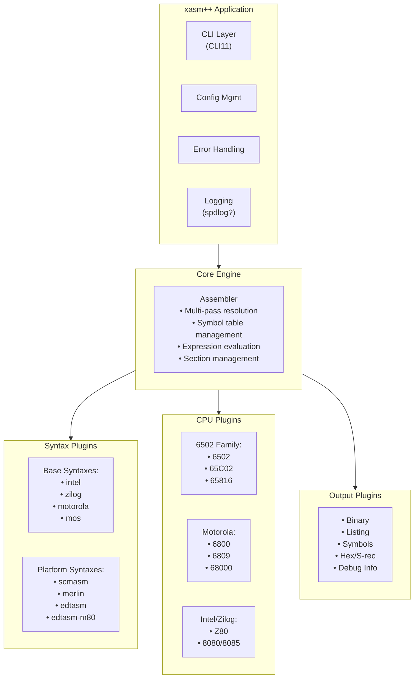
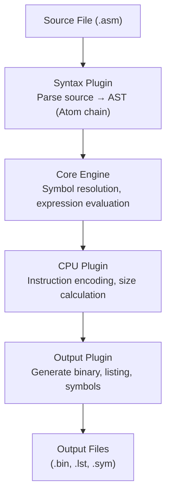

# Architecture Overview

**Version:** 1.0
**Date:** 2026-02-14
**Status:** Current

---

## Executive Summary

**xasm++** is a modern C++ cross-assembler designed with modularity, extensibility, and clean architecture as core principles. It combines the proven modular design of vasm-ext with the SOLID principles and plugin architecture demonstrated in sourcerer.

**Key Goals:**
- Single binary supporting multiple CPU architectures and syntax modes
- Runtime selection of CPU target and syntax dialect
- Plugin architecture for easy addition of new CPUs and syntaxes
- Modern C++17/20 implementation with zero-cost abstractions
- Comprehensive testing and cross-platform support

---

## Architectural Philosophy

xasm++ is designed following SOLID principles and proven design patterns to maximize modularity, extensibility, and maintainability.

### Architectural Patterns

- **Plugin Architecture** - CPU, Syntax, and Output as plugins
- **Strategy Pattern** - Pluggable algorithms for analysis and optimization
- **Factory Pattern** - Plugin creation via registry
- **Template Method** - Shared logic in base classes, customization in derived
- **Visitor Pattern** - AST traversal for analysis and code generation

---

## High-Level Architecture



### Data Flow



---

## Core Abstractions

### The Atom - Intermediate Representation (IR)

Inspired by vasm-ext, the **Atom** is the fundamental unit of assembly:

```cpp
enum class AtomType {
    Label,          // Symbol definition
    Instruction,    // CPU instruction
    Data,           // Raw data bytes
    Space,          // Reserved/uninitialized space
    Align,          // Alignment directive
    Org,            // Origin directive
};

class Atom {
public:
    AtomType type;
    SourceLocation location;        // File, line, column
    size_t size;                    // Size in bytes
    size_t last_size;               // Previous pass size
    uint32_t changes;               // Size change count
    std::variant<
        LabelAtom,
        InstructionAtom,
        DataAtom,
        SpaceAtom,
        AlignAtom,
        OrgAtom
    > content;

    std::shared_ptr<Atom> next;     // Linked list
};
```

**Key Insight:** The atom chain is the IR that all modules manipulate:
- Syntax plugins create atoms from source text
- Core engine resolves symbols and expressions
- CPU plugins size and encode instruction atoms
- Output plugins serialize atoms to files

### Expression Trees

For complex expressions and forward references:

```cpp
class Expression {
public:
    virtual int64_t Evaluate(const SymbolTable& symbols) const = 0;
    virtual bool IsConstant() const = 0;
    virtual bool IsRelocatable() const = 0;
};

class LiteralExpr : public Expression { /* ... */ };
class SymbolExpr : public Expression { /* ... */ };
class BinaryOpExpr : public Expression { /* ... */ };
class UnaryOpExpr : public Expression { /* ... */ };
```

### Symbol Table

```cpp
enum class SymbolType {
    Label,          // Address label
    Equate,         // EQU constant
    Set,            // SET variable
    Macro,          // Macro definition
};

class Symbol {
public:
    std::string name;
    SymbolType type;
    std::shared_ptr<Expression> value;
    Section* section;           // nullptr for absolute symbols
    bool is_exported;
    bool is_imported;
    SourceLocation definition;
};

class SymbolTable {
    // Hash table with optional case-insensitivity
    // Scoping support: global, local (per-section), private (per-context)
};
```

### Section Management

```cpp
enum class SectionAttributes {
    Code    = 0x01,
    Data    = 0x02,
    Bss     = 0x04,
    Read    = 0x08,
    Write   = 0x10,
    Execute = 0x20,
};

class Section {
public:
    std::string name;
    uint32_t attributes;
    uint64_t org;               // Origin address
    std::vector<std::shared_ptr<Atom>> atoms;
    size_t current_offset;
};
```

---

## Plugin Interfaces

### CPU Plugin Interface

```cpp
class CpuPlugin {
public:
    virtual ~CpuPlugin() = default;

    // Metadata
    virtual std::string GetName() const = 0;
    virtual std::string GetDescription() const = 0;

    // Instruction operations
    virtual std::unique_ptr<InstructionAtom>
        ParseInstruction(const std::string& mnemonic,
                        const std::string& operands) = 0;

    virtual size_t CalculateSize(const InstructionAtom& inst,
                                const SymbolTable& symbols,
                                uint64_t address) const = 0;

    virtual std::vector<uint8_t>
        Encode(const InstructionAtom& inst,
              const SymbolTable& symbols,
              uint64_t address) const = 0;

    // Data operations
    virtual std::vector<uint8_t>
        EncodeData(const DataAtom& data,
                  size_t size) const = 0;

    // Analysis helpers (for optimization)
    virtual bool CanOptimizeSize(const InstructionAtom& inst,
                                uint64_t distance) const = 0;
};

// Factory registration
class CpuRegistry {
public:
    using FactoryFunc = std::function<std::unique_ptr<CpuPlugin>()>;

    static CpuRegistry& Instance();
    void Register(const std::string& name, FactoryFunc factory);
    std::unique_ptr<CpuPlugin> Create(const std::string& name);
    std::vector<std::string> GetAvailableCpus() const;
};
```

### Syntax Plugin Interface

```cpp
class SyntaxPlugin {
public:
    virtual ~SyntaxPlugin() = default;

    // Metadata
    virtual std::string GetName() const = 0;
    virtual std::string GetDescription() const = 0;

    // Parsing
    virtual void Initialize(const AssemblerConfig& config) = 0;
    virtual std::vector<std::shared_ptr<Atom>>
        ParseFile(const std::string& filename,
                 CpuPlugin* cpu) = 0;

    // Character tests (for lexer)
    virtual bool IsIdentifierStart(char c) const = 0;
    virtual bool IsIdentifierChar(char c) const = 0;
    virtual char GetCommentChar() const = 0;

    // Directive support
    virtual bool IsDirective(const std::string& word) const = 0;
    virtual void HandleDirective(const std::string& directive,
                                const std::string& args,
                                ParserState& state) = 0;
};

// Factory registration
class SyntaxRegistry {
public:
    using FactoryFunc = std::function<std::unique_ptr<SyntaxPlugin>()>;

    static SyntaxRegistry& Instance();
    void Register(const std::string& name, FactoryFunc factory);
    std::unique_ptr<SyntaxPlugin> Create(const std::string& name);
    std::vector<std::string> GetAvailableSyntaxes() const;
};
```

### Output Plugin Interface

```cpp
class OutputPlugin {
public:
    virtual ~OutputPlugin() = default;

    // Metadata
    virtual std::string GetName() const = 0;
    virtual std::string GetFileExtension() const = 0;

    // Output generation
    virtual void WriteOutput(const std::string& filename,
                           const std::vector<Section*>& sections,
                           const SymbolTable& symbols) = 0;
};

// Factory registration
class OutputRegistry {
    // Similar to CPU and Syntax registries
};
```

---

## Code Reuse Strategy

A key architectural goal is **maximizing code reuse** across CPU families and syntax variants. This reduces maintenance burden, ensures consistency, and accelerates implementation of new plugins.

### CPU Plugin Families

#### 6502 Family (6502 → 65C02 → 65816)

**Inheritance Hierarchy:**
```cpp
class Cpu6502Base {
protected:
    OpcodeTable base_opcodes_;         // Core 6502 instructions
    AddressingModeParser addr_parser_;  // Common addressing modes

    virtual void InitializeOpcodes();   // Base instruction set
    virtual bool SupportsZeroPageOptimization() const { return true; }
};

class Cpu6502 : public Cpu6502Base {
    // Pure 6502 (56 instructions)
};

class Cpu65C02 : public Cpu6502Base {
    void InitializeOpcodes() override;  // Adds 27 new instructions
    // Fixes JMP ($xxFF) bug
    // Adds BIT #immediate, STZ, BRA, etc.
};

class Cpu65816 : public Cpu65C02 {
    void InitializeOpcodes() override;  // Adds 16-bit modes
    // Adds long addressing (24-bit)
    // Adds new registers (DBR, PBR)
    // Mode-switching instructions (REP, SEP)
};
```

**Code Reuse:** 80% (base opcodes) + 15% (addressing modes) = ~80% total

---

#### Intel/Zilog Family (8080 → 8085 → Z80)

**Inheritance Hierarchy:**
```cpp
class Cpu8080Base {
protected:
    OpcodeTable base_opcodes_;     // 78 core 8080 instructions

    void EncodeRegisterPair(uint8_t rp);
    void EncodeConditionCode(ConditionCode cc);
};

class Cpu8080 : public Cpu8080Base {
    // Pure 8080
};

class Cpu8085 : public Cpu8080Base {
    void InitializeOpcodes() override;  // Adds RIM, SIM
    // Adds RST 5.5, 6.5, 7.5 interrupts
};

class CpuZ80 : public Cpu8080Base {
    void InitializeOpcodes() override;  // Massive extension
    // Adds IX, IY index registers
    // Adds bit operations (BIT, SET, RES)
    // Adds block operations (LDIR, CPIR, etc.)
    // Adds alternate register set (EXX, EX AF,AF')
    // Extends all 8080 instructions with IX/IY variants
};
```

**Code Reuse:**
- 8080→8085: 95% (nearly identical)
- 8080→Z80: 60% (Z80 is superset but major extensions)

---

#### Motorola Family (6800 → 6809, separate: 68000)

**Inheritance Hierarchy:**
```cpp
class Motorola8BitBase {
protected:
    virtual void ParseMotorolaAddressingMode(const std::string& operand);
    // Common: immediate (#), direct, extended, indexed
};

class Cpu6800 : public Motorola8BitBase {
    // Simple 8-bit Motorola (72 instructions)
    // Two accumulators (A, B)
    // Index register (X)
};

class Cpu6809 : public Motorola8BitBase {
    void InitializeOpcodes() override;
    // Adds complex indexed modes (16 variants!)
    // Adds Y register, U/S stack pointers
    // Much more orthogonal instruction set
    // Transfers between any registers (TFR, EXG)
};

class Cpu68000 {  // Separate - different architecture
    // 16/32-bit, completely different design
    // Shares Motorola syntax conventions only
    // Minimal code sharing with 8-bit family
};
```

**Code Reuse:**
- 6800→6809: 40% (similar patterns, different capabilities)
- 68000: 10% (syntax conventions only)

---

### Syntax Plugin Families

#### MOS-based Syntaxes (mos → scmasm, merlin)

**Template Method Pattern:**
```cpp
class MosBaseSyntax : public SyntaxPlugin {
protected:
    // Shared addressing mode parsing
    AddressingMode ParseAddressingMode(const std::string& operand);
    // #immediate, zero-page, absolute, indexed, etc.

    // Shared expression parser
    ExpressionPtr ParseExpression(const std::string& expr);
    // Hex ($), binary (%), decimal

    // Shared directives
    virtual void HandleOrgDirective(uint16_t address);
    virtual void HandleEquDirective(const std::string& symbol, int value);

    // Platform-specific hooks
    virtual void HandlePlatformDirective(const std::string& directive) = 0;
    virtual bool ParsePlatformLabel(const std::string& line) = 0;
};

class MosSyntax : public MosBaseSyntax {
    // Generic MOS syntax (minimal)
    void HandlePlatformDirective(const std::string& dir) override { }
};

class ScmasmSyntax : public MosBaseSyntax {
    // Apple II SCMASM extensions
    void HandlePlatformDirective(const std::string& dir) override;
    // Adds: .ASC, .AST, .HEX directives
    // Adds: local labels (:label), private labels (]label)
    // Adds: SCMASM-specific macros
};

class MerlinSyntax : public MosBaseSyntax {
    // Apple IIgs Merlin extensions
    void HandlePlatformDirective(const std::string& dir) override;
    // Adds: 65816-specific directives (MX, REP, SEP awareness)
    // Adds: Merlin label conventions
    // Adds: long addressing support
};
```

**Code Reuse:** 70% (addressing modes, expressions, common directives)

---

#### Motorola-based Syntaxes (motorola → edtasm)

**Template Method Pattern:**
```cpp
class MotorolaBaseSyntax : public SyntaxPlugin {
protected:
    // Motorola conventions: # for immediate
    AddressingMode ParseMotorolaOperand(const std::string& operand);

    // Common directives: ORG, EQU, FCB, FDB, FCC
    void HandleCommonDirective(const std::string& dir);

    virtual void HandlePlatformDirective(const std::string& dir) = 0;
};

class MotorolaSyntax : public MotorolaBaseSyntax {
    // Generic Motorola (works for 6800, 6809, 68000)
};

class EdtasmSyntax : public MotorolaBaseSyntax {
    // CoCo EDTASM+ extensions
    void HandlePlatformDirective(const std::string& dir) override;
    // Adds: USE directive (DECB compatibility)
    // Adds: Disk EDTASM extensions
    // Adds: CoCo-specific features
};
```

**Code Reuse:** 70% (Motorola very consistent)

---

#### Zilog-based Syntaxes (zilog → edtasm-m80)

**Template Method Pattern:**
```cpp
class ZilogBaseSyntax : public SyntaxPlugin {
protected:
    // Z80 addressing: parentheses for indirection
    AddressingMode ParseZilogOperand(const std::string& operand);
    // (HL), (IX+d), (IY+d), etc.

    void HandleCommonDirective(const std::string& dir);
};

class ZilogSyntax : public ZilogBaseSyntax {
    // Standard Zilog syntax
};

class EdtasmM80Syntax : public ZilogBaseSyntax {
    // Z80 EDTASM with M80 compatibility
    void HandlePlatformDirective(const std::string& dir) override;
    // M80-style macros
    // Different expression rules
};
```

**Code Reuse:** 60%

---

### Shared Components (All Plugins)

#### Expression Evaluator
```cpp
class ExpressionEvaluator {
    // Shared by ALL syntax plugins
    int64_t Evaluate(const Expression* expr, const SymbolTable& symbols);

    // Common operators: +, -, *, /, %, <<, >>, &, |, ^
    // Common functions: <, >, ^ (lo/hi/bank byte)
    // Operator precedence
};
```

#### Opcode Table Manager
```cpp
class OpcodeTable {
    // Fast hash-based mnemonic lookup
    // Used by ALL CPU plugins
    void AddOpcode(const std::string& mnemonic, OpcodeInfo info);
    OpcodeInfo* Lookup(const std::string& mnemonic, AddressingMode mode);
};
```

---

### Implementation Guidelines

#### Rule 1: Implement Base First
```
✅ Correct Order:
  1. Implement Cpu6502Base (full 6502)
  2. Extract common code to base class
  3. Implement Cpu65C02 (extends base)
  4. Implement Cpu65816 (extends Cpu65C02)

❌ Wrong Order:
  1. Implement Cpu6502 standalone
  2. Implement Cpu65C02 standalone (duplicates code!)
  3. Try to refactor later (painful!)
```

#### Rule 2: Template Method for Syntax
```cpp
// Base class defines algorithm structure
class SyntaxBase {
    std::vector<Atom> ParseLine(const std::string& line) {
        if (IsDirective(line)) {
            return HandleDirective(line);  // Virtual
        }
        return ParseInstruction(line);     // Virtual
    }
protected:
    virtual bool IsDirective(const std::string& line) = 0;
    virtual std::vector<Atom> HandleDirective(const std::string& line) = 0;
};
```

#### Rule 3: Composition for Extensions
```cpp
class Cpu65C02 : public Cpu6502Base {
    // Inheritance for shared opcodes
private:
    ExtendedInstructionSet extended_;  // Composition for new instructions
};
```

---

### Expected Code Reuse Metrics

| Plugin Pair | Shared % | Mechanism |
|-------------|----------|-----------|
| 6502 → 65C02 | 80% | Inheritance + opcode extension |
| 65C02 → 65816 | 70% | Inheritance + 16-bit modes |
| 8080 → 8085 | 95% | Inheritance + 2 instructions |
| 8080 → Z80 | 60% | Inheritance + major extensions |
| 6800 → 6809 | 40% | Inheritance + new patterns |
| mos → scmasm | 70% | Template method + directives |
| mos → merlin | 65% | Template method + 65816 |
| motorola → edtasm | 70% | Template method + CoCo |
| zilog → edtasm-m80 | 60% | Template method + M80 |

**Overall Target:** 50-70% code reuse across plugin families

---

### Benefits

✅ **Maintainability** - Fix bugs once in base class
✅ **Consistency** - Same patterns across family members
✅ **Testing** - Test base thoroughly, test extensions separately
✅ **Velocity** - Later family members much faster to implement
✅ **Quality** - Proven patterns reduce errors

---

## Multi-Pass Resolution

Following vasm-ext's proven approach:

### Pass Strategy

1. **Initial Pass** - Parse source, create atom chain, collect symbols
2. **Fast Optimization Phase** (passes 2-50)
   - Attempt to optimize all instructions simultaneously
   - Track size changes
   - Continue until stable or phase limit
3. **Safe Optimization Phase** (passes 51-500)
   - Optimize ONE instruction per pass
   - Prevents oscillation
   - Guarantees convergence
4. **Final Pass** - Generate output

### Size Change Tracking

```cpp
class Assembler {
    static constexpr int FAST_PHASE_LIMIT = 50;
    static constexpr int MAX_PASSES = 500;
    static constexpr int MAX_SIZE_CHANGES = 5;

    bool OptimizePass(int pass_number) {
        bool any_changes = false;

        for (auto& atom : atoms) {
            size_t new_size = cpu->CalculateSize(*atom, symbols, atom->address);

            if (new_size != atom->last_size) {
                if (pass_number > FAST_PHASE_LIMIT) {
                    atom->changes++;
                    if (atom->changes > MAX_SIZE_CHANGES) {
                        // Warn: instruction oscillating
                    }
                }
                atom->last_size = new_size;
                any_changes = true;

                if (pass_number > FAST_PHASE_LIMIT) {
                    break;  // Only one change per pass in safe mode
                }
            }
        }

        return any_changes;
    }
};
```

---

## Memory Management

### Smart Pointer Strategy

- `std::unique_ptr<>` - Exclusive ownership (plugins, atoms with no sharing)
- `std::shared_ptr<>` - Shared ownership (atoms in chains, expressions)
- `std::weak_ptr<>` - Non-owning references (avoid cycles)
- Raw pointers - Non-owning references to long-lived objects (CPU plugin passed to parser)

### RAII Principles

All resources acquired via constructors, released via destructors:
- File handles via `std::fstream`
- Memory via smart pointers
- No manual `new`/`delete` in application code

---

## Error Handling

### Strategy

```cpp
class AssemblerError : public std::exception {
public:
    SourceLocation location;
    std::string message;
    ErrorSeverity severity;

    const char* what() const noexcept override;
};

enum class ErrorSeverity {
    Warning,        // Continue assembly
    Error,          // Continue parsing, no output
    Fatal,          // Stop immediately
};
```

### Error Recovery

- Continue parsing after errors to find multiple issues
- Accumulate errors in error list
- Only generate output if no errors (warnings OK)
- Provide clear error messages with file, line, column

---

## Build System Approach

### CMake Structure

```cmake
cmake_minimum_required(VERSION 3.20)
project(xasm++ VERSION 0.1.0 LANGUAGES CXX)

set(CMAKE_CXX_STANDARD 17)
set(CMAKE_CXX_STANDARD_REQUIRED ON)

# Core library (foundation)
add_library(xasm_core STATIC
    src/core/atom.cpp
    src/core/expression.cpp
    src/core/symbol_table.cpp
    src/core/section.cpp
    src/core/assembler.cpp
)

# CPU plugins
add_library(cpu_plugins STATIC
    src/cpu/cpu_registry.cpp
    src/cpu/m6502/cpu_6502.cpp
    src/cpu/m6809/cpu_6809.cpp
    # ... more CPUs
)

# Syntax plugins
add_library(syntax_plugins STATIC
    src/syntax/syntax_registry.cpp
    src/syntax/scmasm/scmasm_syntax.cpp
    src/syntax/merlin/merlin_syntax.cpp
    # ... more syntaxes
)

# Output plugins
add_library(output_plugins STATIC
    src/output/output_registry.cpp
    src/output/binary_output.cpp
    src/output/listing_output.cpp
)

# Main executable
add_executable(xasm++ src/main.cpp)
target_link_libraries(xasm++ PRIVATE
    xasm_core
    cpu_plugins
    syntax_plugins
    output_plugins
)
```

### Dependencies

- **CLI11** - Command-line parsing (header-only, via FetchContent)
- **GoogleTest** - Unit testing (optional, BUILD_TESTING flag)
- **spdlog** (optional) - Structured logging

---

## Testing Strategy

### Test Levels

1. **Unit Tests**
   - Test individual classes in isolation
   - Mock dependencies (e.g., mock CPU plugin for syntax tests)
   - GoogleTest framework

2. **Integration Tests**
   - Test plugin interactions
   - Validate end-to-end parsing → encoding → output
   - Compare output against known-good binaries

3. **Regression Tests**
   - Suite of assembly files with expected output
   - Detect regressions in code generation
   - Drawn from vasm-ext test suites

### Coverage Goals

- Core modules: 90%+ coverage
- Plugin implementations: 80%+ coverage
- Overall: 85%+ coverage

---

## Cross-Platform Support

### Supported Platforms

- **Linux** - GCC 9+, Clang 10+
- **macOS** - Clang 10+ (Xcode 12+)
- **Windows** - MSVC 2019+, MinGW-w64

### Platform Abstractions

- Use standard C++17/20 only (no OS-specific APIs)
- `std::filesystem` for path handling (C++17)
- `std::ifstream`/`std::ofstream` for file I/O
- CMake for build configuration

---

## Performance Considerations

### Design for Performance

1. **Zero-Cost Abstractions**
   - Virtual calls only where necessary (plugin interfaces)
   - Inline small functions
   - Template metaprogramming where beneficial

2. **Memory Layout**
   - Cache-friendly data structures
   - Atom chains as vectors (vs. linked lists) for better locality
   - Symbol table as hash map for O(1) lookup

3. **Lazy Evaluation**
   - Parse macros only when invoked
   - Defer expensive calculations until needed

4. **Parallelization (Future)**
   - Multi-threaded file parsing (independent source files)
   - Parallel optimization passes (analyze dependencies first)

---

## Future Extensibility

### Planned Enhancements

1. **Phase 2 Features**
   - Macro preprocessor with parameters
   - Conditional assembly (IF/ELSE/ENDIF)
   - Include file support
   - Local labels

2. **Phase 3 Features**
   - Link-time optimization
   - Dead code elimination
   - Cross-reference generation
   - Source-level debugging support

3. **Phase 4 Features**
   - Language server protocol (LSP) support
   - IDE integration
   - Interactive mode (REPL)

### Extension Points

- New CPU: Implement `CpuPlugin`, register in registry
- New syntax: Implement `SyntaxPlugin`, register in registry
- New output format: Implement `OutputPlugin`, register in registry
- New optimization: Add strategy to optimization pipeline

---

## Comparison with Reference Projects

### Borrowed from vasm-ext

- ✅ Three-layer modular design (Syntax/CPU/Output)
- ✅ Atom-based intermediate representation
- ✅ Multi-pass resolution with optimization
- ✅ Expression tree evaluation
- ✅ Symbol table with scoping
- ✅ Section management

### Borrowed from sourcerer

- ✅ Plugin architecture with registries
- ✅ SOLID principles throughout
- ✅ Strategy pattern for algorithms
- ✅ Dependency injection
- ✅ Modern C++17 idioms (smart pointers, std::variant)
- ✅ Comprehensive unit testing with GoogleTest

### Differences from vasm-ext

- Modern C++17/20 instead of C90
- Single binary instead of multiple per-CPU binaries
- Runtime plugin selection instead of compile-time
- Object-oriented design instead of procedural
- CMake instead of Makefile

### Differences from sourcerer

- Assembler instead of disassembler
- Multi-pass resolution for forward references
- Macro preprocessing and expression evaluation
- Output generation (binary, listings)

---

## Next Steps

1. Review and approve this architecture document
2. Create detailed specifications for each plugin interface
3. Define core abstraction classes in detail
4. Specify build system structure
5. Create phased implementation plan
6. Begin Phase 1 implementation (minimal viable assembler)

---

## References

Additional architecture documentation coming soon:
- Core Abstractions
- CPU Plugin Interface
- Syntax Plugin Interface
- Build System
- Testing Strategy

---

**Document Status:** ✅ Current (as of 2026-02-14)
**Owner:** Cortexa LLC

## Additional Architecture Documentation

For comprehensive architecture details, see:
- [Architecture Index](https://github.com/Cortexa-LLC/xasm-plus-plus/blob/main/docs/architecture/INDEX.md) - Complete architecture guide
- [Architecture README](https://github.com/Cortexa-LLC/xasm-plus-plus/blob/main/docs/architecture/README.md) - Detailed component interactions
- [Plugin Architecture](https://github.com/Cortexa-LLC/xasm-plus-plus/blob/main/docs/architecture/03-plugin-architecture.md) - Plugin system design
- [Multi-Pass Assembly](https://github.com/Cortexa-LLC/xasm-plus-plus/blob/main/docs/architecture/06-multipass-assembly.md) - Assembly algorithm details
- [Design Patterns](https://github.com/Cortexa-LLC/xasm-plus-plus/blob/main/docs/architecture/09-design-patterns.md) - Pattern catalog
- [ADR Summary](https://github.com/Cortexa-LLC/xasm-plus-plus/blob/main/docs/architecture/10-adr-summary.md) - Architecture decisions

### Recent Architecture Updates (February 2026)

#### P2 Work Completed
- ✅ **Utility Modules** - String, File, and Path utilities extracted
- ✅ **Build Reorganization** - Clean output structure (build/bin/, build/lib/, build/Testing/)
- ✅ **Architecture Documentation** - Complete guide with component interactions
- ✅ **ADR Documentation** - Architecture Decision Records for key choices
- ✅ **Test Coverage** - 1649/1649 tests passing (100%)

#### Current System State
- **CPUs Implemented:** 6502, 65C02, 65C02 Rockwell, 65816, 6809, Z80
- **Syntax Parsers:** Merlin, SCMASM, EDTASM, FlexASM, Z80Universal, SimpleSyntax
- **Build System:** CMake 3.20+ with organized output directories
- **Testing:** Comprehensive unit and integration tests with 100% pass rate
